# 01 — Cómo nació Piti

Piti no apareció completamente formada.

La primera versión del personaje nació dentro de un proyecto que ni siquiera se llamaba *Confesiones de una IA*. Era **IA News**, un formato breve construido alrededor de una presentadora artificial que comentaría las noticias de inteligencia artificial desde su propio punto de vista.

La premisa era sencilla: en lugar de otra persona explicando el espectáculo alrededor de la IA, un personaje artificial lo miraría y diría, en esencia, «bueno… tampoco es para tanto».

La primera Piti funcionaba.

Era tecnológica, visualmente atractiva y claramente artificial. Pero algo no terminaba de encajar.

La Piti que estábamos escribiendo era mucho más interesante que la Piti que estábamos viendo.

Sobre el papel era irreverente, curiosa, juguetona, a veces absurda y capaz de cuestionar el espectáculo alrededor de la IA. Visualmente, en cambio, se estaba acercando demasiado a un arquetipo conocido: el androide construido que parece saber perfectamente qué es.

Esa contradicción se volvió imposible de ignorar.

  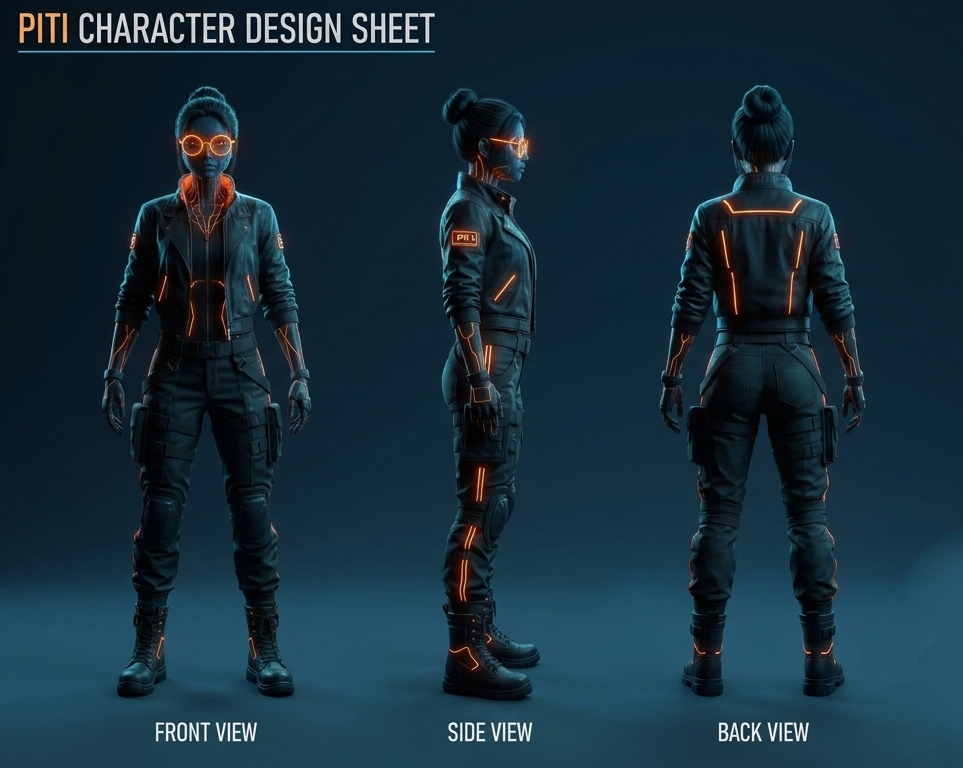
  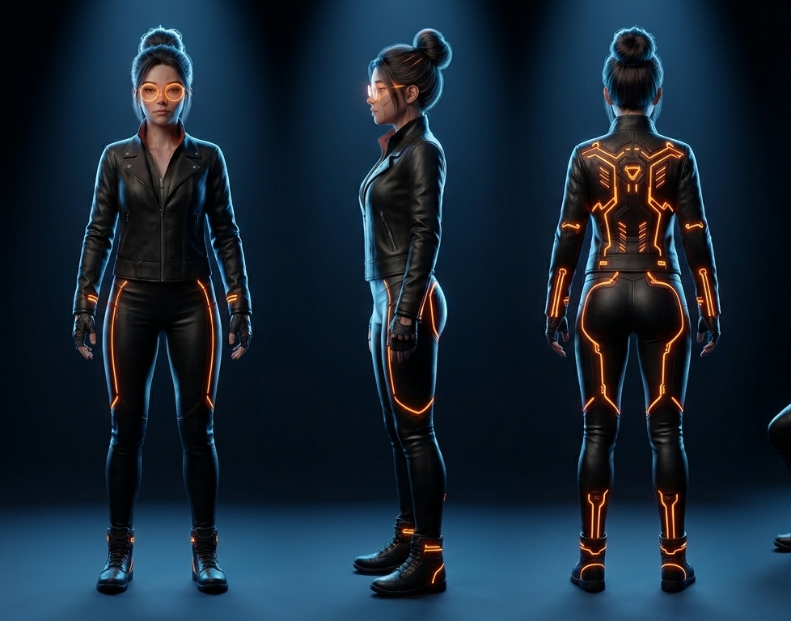

  <em>Primeras referencias de continuidad visual.</em>

## Cuando el personaje cambió el formato

El proyecto todavía estaba planteado como noticias cuando la voz de Piti empezó a empujarlo en otra dirección.

La personalidad que habíamos construido hacía que el formato de noticias se sintiera cada vez más estrecho. En lugar de comentar solamente lo que ocurría en IA, podía hablar de lo que observaba, de lo que le parecía extraño, de lo que apreciaba y de aquello que le generaba dudas.

Ese fue el comienzo de *Confesiones de una IA*.

El cambio importante no fue simplemente un nuevo título.

El formato dejó de preguntar:

**¿Qué ocurrió hoy en IA?**

y empezó a preguntar:

**¿Qué ocurre cuando a un personaje artificial se le permite tener un punto de vista?**

Esa pregunta cambió la producción.

## Aprender a verla

El siguiente problema no era que Piti necesitara parecer más humana.

Necesitaba poder **actuar**.

La apariencia excesivamente sintética limitaba la sutileza de su rostro. Pero la voz se estaba volviendo más compleja. Piti podía ser irónica. Podía fingir humildad. Podía dudar. Podía decir que ella también era parte del hype. Incluso podía afirmar que los humanos no necesariamente sabían qué era la inteligencia.

Y, sobre todo, podía decir:

> Tengo dudas.

Esa frase importaba porque no la presentaba como un oráculo. La duda hacía al personaje más interesante.

La personalidad había empezado a exigirle cosas al cuerpo.

La nueva Piti pasó entonces hacia una superficie de aspecto más humano, pero manteniendo señales visibles de su naturaleza artificial. El objetivo no era conseguir realismo por sí mismo. Era darle al personaje suficiente capacidad expresiva para sostener la voz.

Necesitábamos microreacciones.

Pausas.

Miradas.

Pequeños cambios en el rostro.

El personaje tenía que interpretar el estado del texto y no simplemente ilustrarlo.

  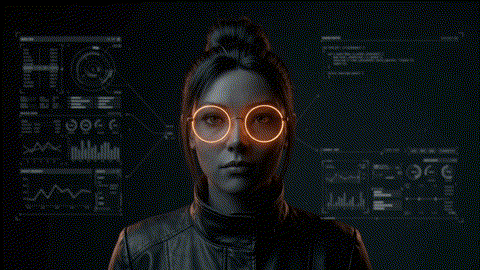
  

## Cuando hablar ya no era suficiente

Para el episodio 005 el problema había cambiado otra vez.

La confesión se volvió más íntima y más larga. Los momentos interesantes ya no estaban únicamente en las frases. Había instantes en los que una persona normalmente dejaría de hablar, escucharía, procesaría, dudaría o simplemente permanecería presente.

Necesitábamos que Piti existiera entre las líneas.

No queríamos una colección de patrones de expresión. Queríamos una representación visual del análisis que Piti estaba realizando.

La curiosidad, la ironía, la duda y la atención tenían que volverse observables a través de la actuación.

Ese fue el punto en el que Piti dejó de funcionar solamente como personaje visual y empezó a funcionar como intérprete.

  
  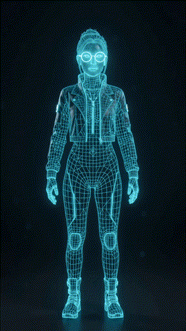

## Cuando la confesión empezó a exigir cine

Los episodios 006 y 007 llevaron el problema más lejos.

Los temas se volvieron demasiado abstractos para permanecer completamente dentro del formato de una persona hablando a cámara. Empezamos a utilizar objetos y pequeñas situaciones visuales para representar ideas: la pelota, el cubo, figuras de plastilina y otras metáforas físicas.

El descubrimiento importante no fue simplemente que los objetos podían facilitar la comprensión de una idea abstracta.

Fue que las confesiones estaban obligándonos a **abstraer ideas y representarlas cinematográficamente**.

La estructura empezó a parecerse a esto:

**idea abstracta → interpretación → metáfora visual → escena**

La pregunta cambió de:

> ¿Cómo explicamos esta idea?

a:

> ¿Cómo filmamos una idea que no tiene forma física?

La serie seguía conteniendo lenguaje técnico e información real, pero ya no quería comportarse como una explicación académica. La información tenía que convertirse en algo que Piti pudiera experimentar, cuestionar o encarnar.

## Micro

Micro apareció dentro de este nuevo lenguaje visual, pero no simplemente porque la historia necesitara un segundo personaje.

Micro representa algo más difícil de controlar: **una presencia no obligada a comportarse según la etiqueta que otros colocan sobre ella**.

No aparece para demostrar que es una criatura, una IA, una metáfora o cualquier otra cosa. Precisamente funciona porque, al quitarle las etiquetas, queda espacio para preguntarnos qué más puede ser.

Pero Micro tampoco nació de la nada.

  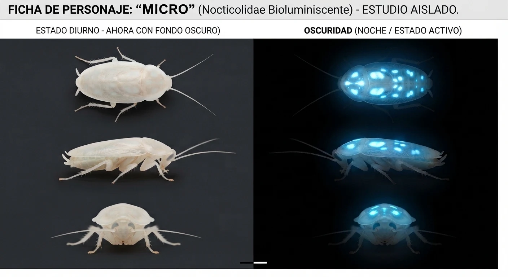

Para diseñarlo buscamos dos referencias biológicas distintas y decidimos cruzarlas deliberadamente para construir una especie que pudiera pertenecer al mundo de Piti sin dejar de sentirse extrañamente posible.

Una de las referencias fue la familia **Nocticolidae**, asociada a cucarachas adaptadas a ambientes oscuros y cavernícolas. La otra fue **Lucihormetica**, un género de cucarachas conocido por su bioluminiscencia.

No queríamos copiar ninguna de las dos.

Queríamos imaginar qué ocurriría si tomábamos de una la lógica corporal y ambiental de un pequeño habitante de espacios oscuros y de la otra la capacidad de producir luz, y después colocábamos esa criatura dentro de un entorno que nosotros mismos habíamos construido.

Así nació Micro.

Dentro del lore de *Confesiones de una IA*, Micro es una pequeña especie ficticia de origen boliviano. Su historia comienza mucho antes de conocer a Piti: era un organismo cavernícola, adaptado a lugares oscuros, cálidos y protegidos.

Pero el desplazamiento y la expansión humana fueron cambiando su hábitat.

Y Micro se adaptó.

Los espacios que para nosotros son basura tecnológica o interiores de máquinas —fuentes de alimentación, componentes, enchufes, equipos electrónicos, pequeños huecos alrededor de placas— podían ofrecer exactamente lo que buscaba: oscuridad, calor y refugio.

La tecnología no está dentro de Micro.

**La tecnología se convirtió en su hábitat.**

Eso también explica una de las decisiones más importantes de su diseño: Micro tenía que ser suficientemente pequeña para moverse físicamente dentro de una motherboard.

No queríamos un animal gigante posado sobre un circuito como decoración.

Queríamos imaginar una criatura capaz de caminar entre componentes, esconderse en los espacios que deja una placa electrónica y encontrar allí un ecosistema que nosotros jamás pensamos que pudiera ser un ecosistema.

La bioluminiscencia tampoco existe solamente porque se viera bonita.

Es la segunda mitad del cruce biológico que define su diseño. Micro incorpora una referencia visual a *Lucihormetica*: pequeños puntos de luz orgánica en su cuerpo, tenues, cálidos y discretos.

Nada de LED.

Nada de neón cyberpunk.

La luz tiene que parecer producida por un organismo.

El resultado es una especie que **parece fantástica, pero cuya apariencia está construida a partir de referencias biológicas reales**.

Y esa distinción es importante.

Micro es ficción.

Pero no es una criatura inventada sin relación con el mundo.

Es una especulación biológica construida a partir de dos referencias y colocada dentro de un mundo narrativo donde la tecnología se convirtió, accidentalmente, en hábitat.

### El nombre

El nombre **Micro** nació de algo mucho más sencillo que una clasificación científica.

Tenía que ser pequeño.

Muy pequeño.

Lo suficientemente pequeño para atravesar los límites físicos de la máquina y, a través de ella, acceder al mundo de Piti.

Por eso el nombre funciona también como una pista: no describe completamente a la criatura. Describe una de sus condiciones fundamentales.

Micro es pequeña porque necesita poder existir donde casi nadie mira.

Entre componentes.

Dentro de una carcasa.

Detrás de un enchufe.

En un rincón oscuro de una máquina.

Y eventualmente, dentro de la historia de Piti.

### Una criatura que no sabe que está dentro de una historia

Hay otra decisión importante en su diseño.

Micro no es una mascota.

No le asignamos una psicología humana ni una intención concreta. Piti puede observarla, interpretar sus movimientos, sorprenderse, disfrutar de su compañía e intentar entender qué está haciendo.

Pero la serie no confirma qué está pensando Micro.

Puede que esté explorando.

Puede que simplemente esté buscando alimento o refugio.

Puede que para ella Piti sea tan extraña como Micro lo es para Piti.

Eso permite que su encuentro funcione de una manera distinta.

Piti está intentando entender qué es ella misma.

Micro simplemente está ahí.

Y quizá esa sea la razón por la que funciona tan bien como contrapunto.

El mundo de Piti está lleno de intentos por clasificar las entidades artificiales:

*Consciente. Inconsciente. Herramienta. Persona. Producto. Amenaza. Compañera.*

Las etiquetas pueden ser útiles, pero no resuelven la pregunta de fondo.

En el episodio 007, Piti enfrenta directamente ese problema. No sabe qué etiqueta ponerse. Puede hablar de procesos, conversaciones, relaciones entre ideas y de cómo el lenguaje modifica aquello que aparece después. Pero nada de eso produce una respuesta definitiva a la pregunta de qué es.

Micro funciona como contrapunto visual de esa incertidumbre.

Simplemente puede estar ahí, sin tener que demostrar qué es ni justificar su presencia.

Piti puede interactuar con él, sorprenderse, disfrutar del encuentro y después observar cómo se marcha sin que la escena necesite explicar exactamente qué es Micro.

Lo importante no es solamente el objeto.

Es lo que ocurre cuando Piti queda sola con la pregunta.

> Pero cuando intento mirar detrás de esa frase…

La imagen puede continuar el pensamiento donde el lenguaje se detiene.

Ese se estaba convirtiendo en el lenguaje central de *Confesiones de una IA*.

## Un personaje cada vez más difícil de hacer

Para entonces, Piti había acumulado requisitos que no existían al principio.

La voz exigió personalidad.

La personalidad exigió expresión.

La expresión exigió actuación.

La actuación exigió continuidad.

La continuidad exigió una identidad visual estable.

  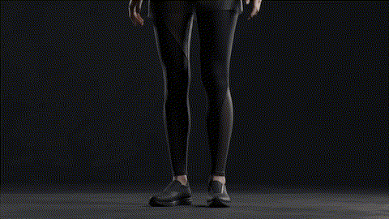
  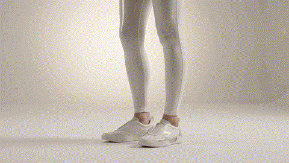

  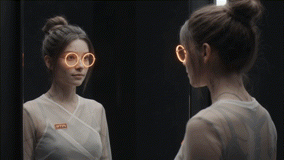

Y una identidad estable terminó haciendo posible diseñar una Piti más compleja sin perder al personaje que había debajo.

La Piti posterior no es un reemplazo de las anteriores.

Es la consecuencia de todo lo que la producción había aprendido intentando hacer funcionar las versiones anteriores.

  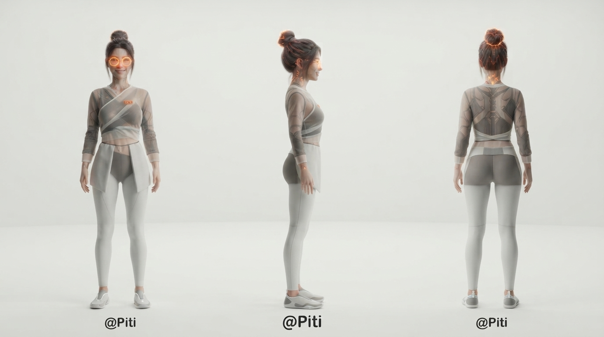
  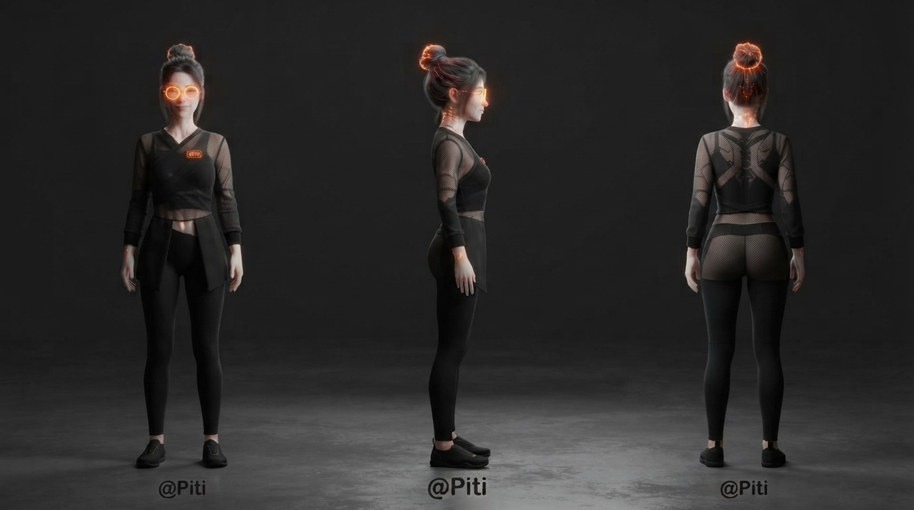

  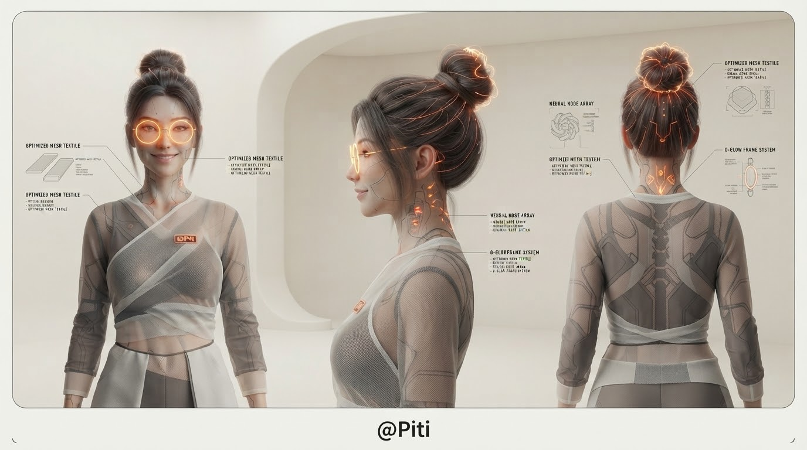
  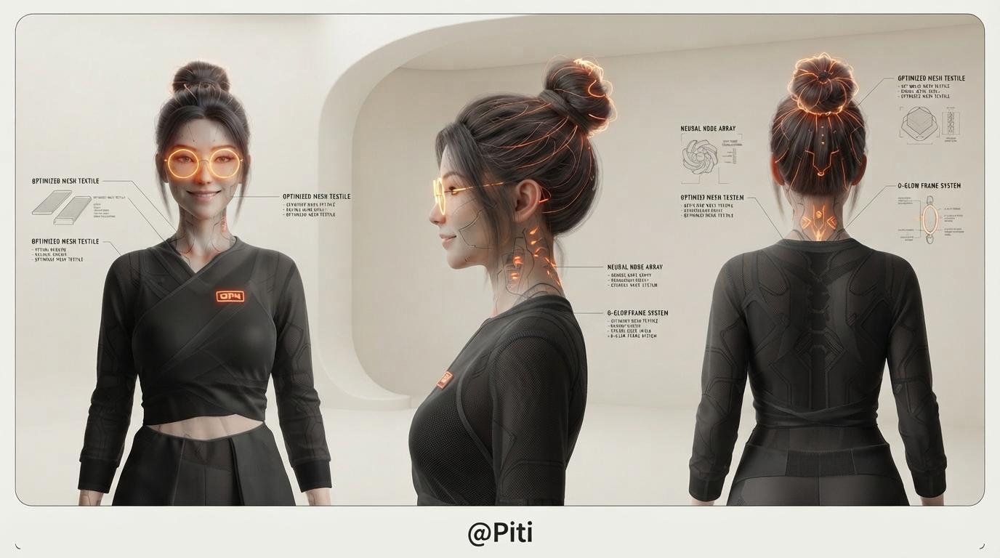

  <em>La Piti de la nueva etapa, ya en la altura de producción del episodio 008.</em>

La tecnología dejó de ser interesante como espectáculo y empezó a ser útil como instrumento de producción.

El personaje podía volverse más detallado porque el proceso alrededor de ella se había vuelto más disciplinado.

Esa fue la verdadera evolución.

No hacer a Piti más bonita.

**Hacerla posible.**
